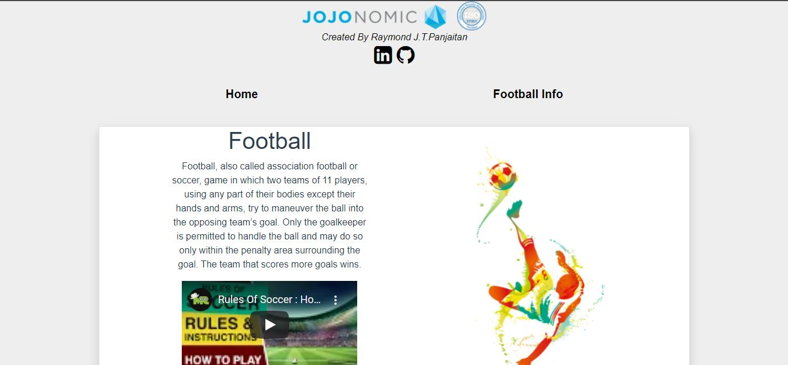
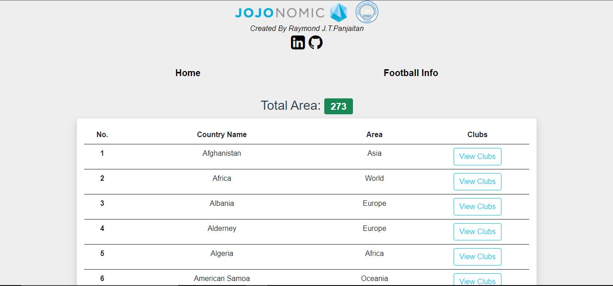
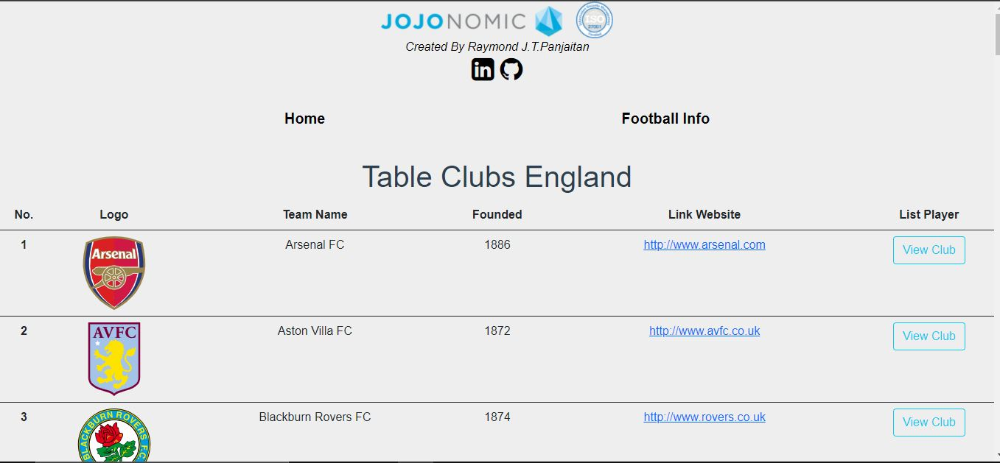
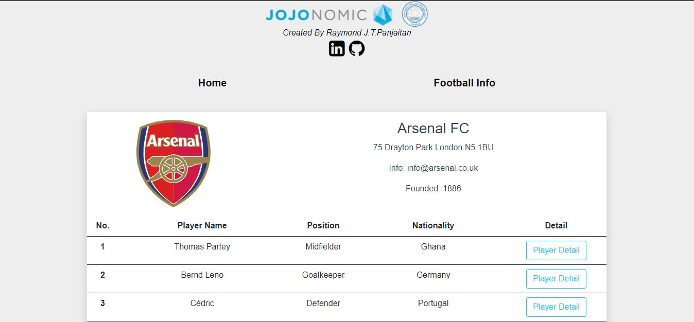
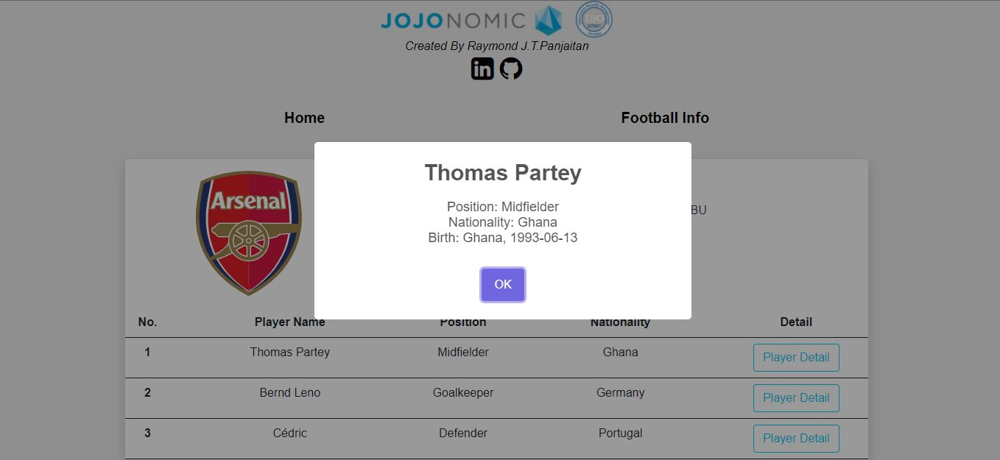
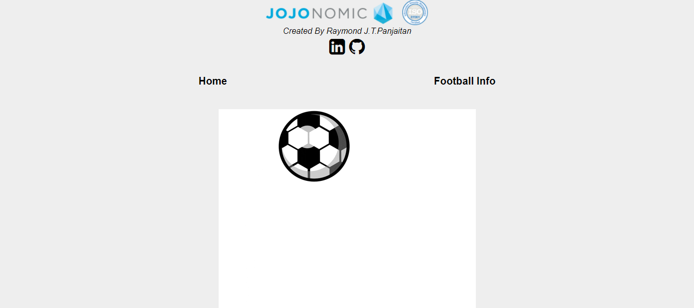

Football App

Football App is a application that shows data of football on Earth. The data is get from third party API https://www.football-data.org. There are total 4 endpoints to build Football App. 

A. Explanation:
//Header/Navbar
1. For the first page, there is a logo of Jojonomic, a company that gave me this task as test for the recrutment.
2. Below logo, there is developer which is me that develop Football App. Also, there are LinkedIn and Github link attached.
3. Navbar consists of Home and Football Info.
4. Home shows the simple explanation about football sport and video from Youtube as further explanation.
5. Football Info shows every area/country that https://www.football-data.org. record on their database. Each area has their own clubs and there is a button View Clubs to show clubs on that area/country.
* Not every area has their clubs. Probably, https://www.football-data.org. didn't record completely on their database.
6. Button View Clubs will directing page to list clubs on the selected area/country and shown by table. There is View Player Button to show every player on the club selected.
7. Button View Player will directing page to list player on the selected club. 
8. We also can show the detail of the player.

B. Extra Works
Create loading gif animation when the data is not completely fetched.
Embed youtube video.
Using modal sweet alert to show detail player.

C. Setup Instructions
1. Make mockup for web interface
2. Install Vue Cli (I already has own it on my global)
3. Create folder with Vue Ex
4. Fetch every endpoints that required on store state and check it on console log.
5. After all data already been fetched, build html css framework.
 (using bootstrap framework).
6. Fetch data from store and put the data on html so the data can be shown on web interface.
7. After all data is shown, put some css using bootstrap to make it more responsive and beautiful.
8. Check interaction each page by using router.

